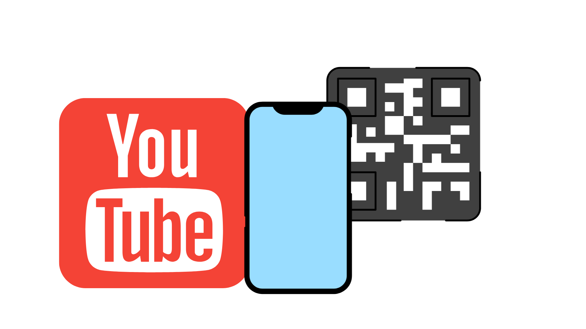

<!-- PROJECT LOGO -->
<br />
<div align="center">
  <a href="https://github.com/RaulMaya/E-Commerce-BackEnd">
    
  </a>

  <h2 align="center">E-Commerce-BackEnd</h2>
  <h4 align="center">Express.JS - Sequelize.JS & MySQL Backend Application</h4>
  
<br/>
<p align="center">
    <a href="LICENSE" target="_blank">
        
    </a>
    <a href="https://www.mysql.com/" target="_blank">
        
    </a>
    <a href="https://nodejs.org/en/docs/" target="_blank">
        
    </a>
    <a href="https://sequelize.org/" target="_blank">
        
    </a>
    <div style="position:relative;width:fit-content;height:fit-content;">
        <a style="position:absolute;top:20px;right:1rem;opacity:0.8;" href="https://clipchamp.com/watch/o5aIQ6qJvCq?utm_source=braze&utm_medium=email&utm_campaign=Share_Page_Created&utm_term=Variant+1">
            
        </a>
    </div>
</p>
<br/>

<p align="center">
E-commerce site using Express.js API to use Sequelize to interact with a MySQL database.
    <br />
    <br />
    <a href="https://github.com/RaulMaya/E-Commerce-BackEnd">Repository</a>    
    ·
    <a href="https://www.youtube.com/watch?v=QrGv7D522GI">Video</a>
    ·
    <a href="https://www.linkedin.com/in/raul-maya/">My LinkedIn</a>

  </p>
</div>

### Content Table

- [About](#about)
- [Usage](#usage)
- [Installation](#installation)
- [Video](#video)
- [License](#license)
- [Contact](#contact)

<br>

### About

<p>
This app is a set of routes for an e-commerce backend application that allows CRUD operations on Products, Categories, and Tags.

It starts by importing the required modules, including the models for Product, Category, Tag, and ProductTag.</p>

<p>This application defines handles HTTP requests for a product database API. The API is designed to work with a database that contains tables for products, categories, tags, and a many-to-many association between products and tags.</p>

<p>It also imports and uses four models: Product, Category, Tag, and ProductTag, which were defined in separate files..</p>

<p>The application uses Sequelize ORM to establish the relationships between the Product, Category, Tag, and ProductTag models. Specifically, Products belong to a Category, Categories have many Products, and Products belong to many Tags through the ProductTag model. Additionally, Tags belong to many Products through the ProductTag model.</p>

<br>

### Usage

<p> To provide a RESTful API that handles CRUD (Create, Read, Update, Delete) operations for Products, Categories, and Tags.

The API supports endpoints for getting all products, getting a single product by ID, creating a new product, updating an existing product, and deleting a product. Additionally, it supports endpoints for getting all categories and tags, and for creating new categories and tags..</p>

<br>

### Installation

```
git@github.com:RaulMaya/E-Commerce-BackEnd.git
npm i
npm run seed
npm start
```

<br>

### Video

<a href="https://www.youtube.com/watch?v=QrGv7D522GI">

</a>
 
<br>

### License

> You can check out the full license [here](https://github.com/RaulMaya/Ballon-dOr-Winners-DB/blob/master/LICENSE)
> This project is licensed under the terms of the **MIT** license.

<br>

### Contact

- Name: Raul Maya Salazar
- Phone: +52 833 159 7006
- E-mail: raulmayas20@gmail.com
- GitHub: https://github.com/RaulMaya
- LinkedIn: https://www.linkedin.com/in/raul-maya/

<p align="right">(<a href="#top">back to top</a>)</p>
